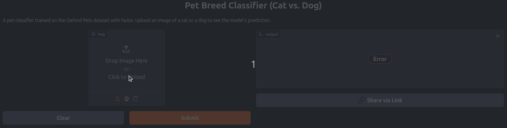

# Pet Breed Classifier (Cat vs. Dog) 🐱🐶

[]([YOUR_GRADIO_APP_LINK_HERE](https://huggingface.co/spaces/adarshsan/oxford-pet-classifier)) 
[](https://github.com/adarsh070/Oxford-pet-classifier/tree/main#) 

A simple yet effective web application that classifies uploaded images as either a 'Cat' or a 'Dog'. This project demonstrates an end-to-end machine learning workflow, from training a deep learning model to deploying it as an interactive web application using Gradio.

---

**Live Demo:** [**Click here to try the Cat vs. Dog Classifier!**](https://huggingface.co/spaces/adarshsan/oxford-pet-classifier) 

---



## 📝 Table of Contents

*   [About The Project](#about-the-project)
*   [Model & Dataset](#model--dataset)
*   [Technologies Used](#technologies-used)
*   [Project Structure](#project-structure)
*   [Getting Started](#getting-started)
    *   [Prerequisites](#prerequisites)
    *   [Installation & Setup](#installation--setup)
    *   [Running the Application](#running-the-application)
*   [Deployment](#deployment)
*   [Key Learnings](#key-learnings)
*   [Future Enhancements](#future-enhancements)
*   [Contributing](#contributing)
*   [License](#license)
*   [Acknowledgements](#acknowledgements)

## 🧐 About The Project

This project aims to provide a user-friendly interface for classifying images of cats and dogs. The core of the application is a deep learning model built with the Fast.ai library, leveraging the power of PyTorch. The model has been trained on the [Oxford-IIIT Pet Dataset](https://www.robots.ox.ac.uk/~vgg/data/pets/) to learn distinguishing features between these two common pets. The web interface is built using Gradio, allowing for easy image uploads and displaying the model's predictions.

## 🧠 Model & Dataset

*   **Dataset:** The model was trained using images from the [Oxford-IIIT Pet Dataset](https://www.robots.ox.ac.uk/~vgg/data/pets/). While the original dataset contains many breeds, this specific model focuses on the binary classification of 'Cat' vs. 'Dog'.
    *   *Note: The `app.py` currently uses example images for `ImageDataLoaders` instantiation for the learner. The actual training involved a much larger portion of the Oxford Pets dataset, and `model_weights.pth` contains these learned weights.*
*   **Model Architecture:** A `resnet18` convolutional neural network (CNN) architecture was used, leveraging transfer learning from pre-trained ImageNet weights.
*   **Training Framework:** [Fast.ai](https://docs.fast.ai/) (which uses PyTorch as its backend).
*   **Key Training Aspects:**
    *   Transfer Learning: Utilizing a pre-trained ResNet18 model.
    *   Fine-tuning: Adapting the pre-trained model to the specific task of cat vs. dog classification.
    *   Metrics: `error_rate` was used during training to monitor performance.
*   **Performance:**

       > The model was trained in stages, initially fitting the head and then fine-tuning the entire network.
    >
    > *   **Initial Head Training (1 epoch):**
    >     *   Validation Loss: ~0.0556
    >     *   Error Rate: ~1.69%
    > *   **Fine-tuning (3 epochs):**
    >     *   Best Validation Loss: ~0.0357 (Epoch 2 of fine-tuning)
    >     *   Best Error Rate: **~0.947%** (Epoch 2 of fine-tuning, accuracy ~99.05%)
    >

## 🛠️ Technologies Used

*   **Python:** Core programming language.
*   **Fast.ai:** High-level deep learning library used for model training and inference.
*   **PyTorch:** Backend deep learning framework for Fast.ai.
*   **Gradio:** For creating and deploying the interactive web UI.
*   **scikit-image:** Used by Fast.ai for image processing.
*   **NumPy/Pandas:** (Implicitly used by Fast.ai/other libraries for data handling).
*   **Git & GitHub:** For version control and hosting the project.
*   **(Your Deployment Platform):** e.g., Hugging Face Spaces, Heroku, AWS, etc.

## 📂 Project Structure

```text
.
├── models/
│   └── model_weights.pth   # Pre-trained model weights
├── app.py                  # Gradio application script
├── cat_example.jpg         # Example cat image for Gradio UI
├── dog_example.jpg         # Example dog image for Gradio UI
├── requirements.txt        # Python dependencies
├── vocab.pkl               # Vocabulary file for labels (serialized)
└── README.md               # This file
```
## 🚀 Getting Started

To get a local copy up and running, follow these simple steps.

### Prerequisites

*   Python 3.8+
*   pip (Python package installer)
*   Git (for cloning the repository)

### Installation & Setup

1.  **Clone the repository:**
    ```bash
    git clone git@github.com:adarsh070/Oxford-pet-classifier.git # Use a password protected SSH Key
    cd Oxford-pet-classifier
    ```

2.  **Create and activate a virtual environment (recommended):**
    ```bash
    python -m venv venv
    # On Windows
    venv\Scripts\activate
    # On macOS/Linux
    source venv/bin/activate
    ```

3.  **Install dependencies:**
    ```bash
    pip install -r requirements.txt
    ```

4.  **Model Weights:**
    The `model_weights.pth` file should be located in the `models/` directory relative to `app.py`. Ensure it's correctly placed if you've downloaded it separately or if Git LFS was used. *(If using Git LFS, users might need to run `git lfs pull` after cloning).*

### Running the Application

Once the setup is complete, you can run the Gradio application locally:

```bash
python app.py
